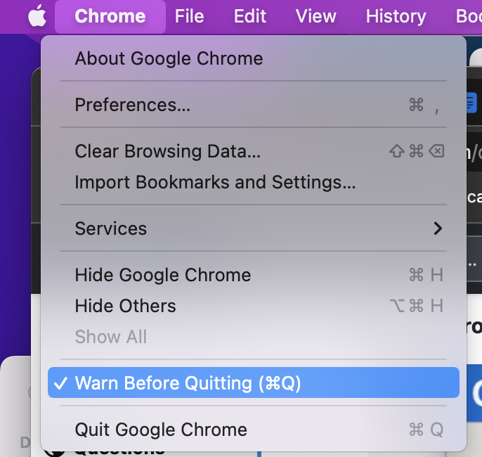

## plugins

* uBlock Origin
* Dark Reader
* SmoothScroll
* Tab-Snap 
* Session Buddy
* HTTPS Everywhere
* Video Speed Controller
* Open Tabs Next to Current

## download pdf directly

### disable pdf viewer
1. Go to `chrome://settings/content`
2. Find Chrome PDF Viewer in the list and click the Disable link

## shortcuts

```
^e  search google
```

Show/hide bookmarks bar:

```
Cmd + Shift + B
```
## export bookmarks

Go to:  
chrome://bookmarks/  
Click on 'Organize' --> 'Export bookmarks to HTML'

## Obtain User Cookies

Enter Chrome dev tool by `Cmd + Opt + J`.  
Go to `Network` Tab;  
Cmd + R to refresh;  
click on `www.example.com`;  
Find `Request Headers`;  
cookie: <several long strings, which is the cookie>

## Disable Ctrl-Q



### Opera

Go to `opera://config` --> Shortcuts --> Hold Command-Q (or press it twice) to quit Opera

## Deleting a specific URL suggestion in Chrome

https://superuser.com/questions/398385/deleting-a-specific-url-suggestion-in-chrome

To delete a single autosuggested URL, start typing the address as you normally would. Then, when the unwanted autocomplete suggestion appears, use your keyboard's arrow keys to highlight the suggestion in the drop-down menu below the address bar.

Finally, press `Shift+Delete` and poof! The suggestion disappears.

On a Mac, you may have to press `Shift+Fn+Delete`.
(Fn is at left bottom corner on laptop keyboard).

## Set Chrome to go to last used tab after tab is closed

Use FLST Chrome Extension (Focus Last Selected Tab)

https://chrome.google.com/webstore/detail/flst-chrome/ajnianifcggmdojhnmjichjmnjpplcha/details
``
## Rearrange Tabs

https://chrome.google.com/webstore/detail/rearrange-tabs/ccnnhhnmpoffieppjjkhdakcoejcpbga

To move selected tab(s) left:

* Mac: Ctrl+Shift+Left
* Windows: Shift+Alt+Left

