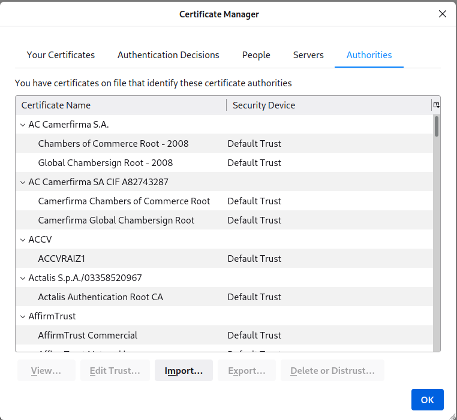

### Disable accidental `ctrl+q`

1. Go to `about:config`
2. Set `browser.showQuitWarning = true`

### Enable Backspace

1. Go to `about:config`
2. Search for `browser:backspace_action`. Set it to `0` (from `2`).

## Add-ons

* HTTPS Everywhere 
* uBlock Origin
* Privacy Badger
* FoxyProxy
* DarkReader

## Tips 

### Increase Facebook video play speed

In Firefox, you can `Shift + Right Click` on the video(to bypass our custom right-click menu and get the native one) and there's a "Play Speed" option.

### Opening web browser tabs next to current

1. Go to `about:config`
2. Toggle the “browser.tabls.insertAfterCurrent” switch to “true” (default is “false”)

### disable Sponsored shortcuts altogether.

1. Click the `menu` Button and select `Settings`.
2. Select the `Home` Panel.
3. In the `Firefox Home Content` section, unselect `Sponsored shortcuts`.

### View Certificate Authorities' Certificates

'Settings' --> 'Privacy & Security' --> 'Security' --> 'View Certificates' --> 'Authorities'

### Only show Bookmarks Toolbar on new tab.

2. Click on the three horizontal lines (menu) in the top right corner.
3. Go to "Bookmarks" > "Show Bookmarks Toolbar". This will toggle the bookmarks bar to be always shown or hidden.
4. Right-click on the bookmarks bar.
5. Click on "Bookmarks Toolbar" is checked to keep it visible.
6. Check "Only show on new tab".

