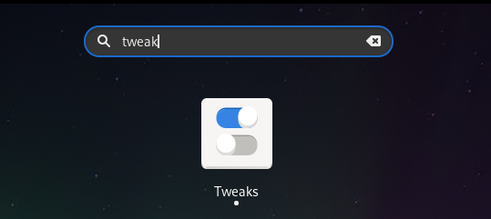
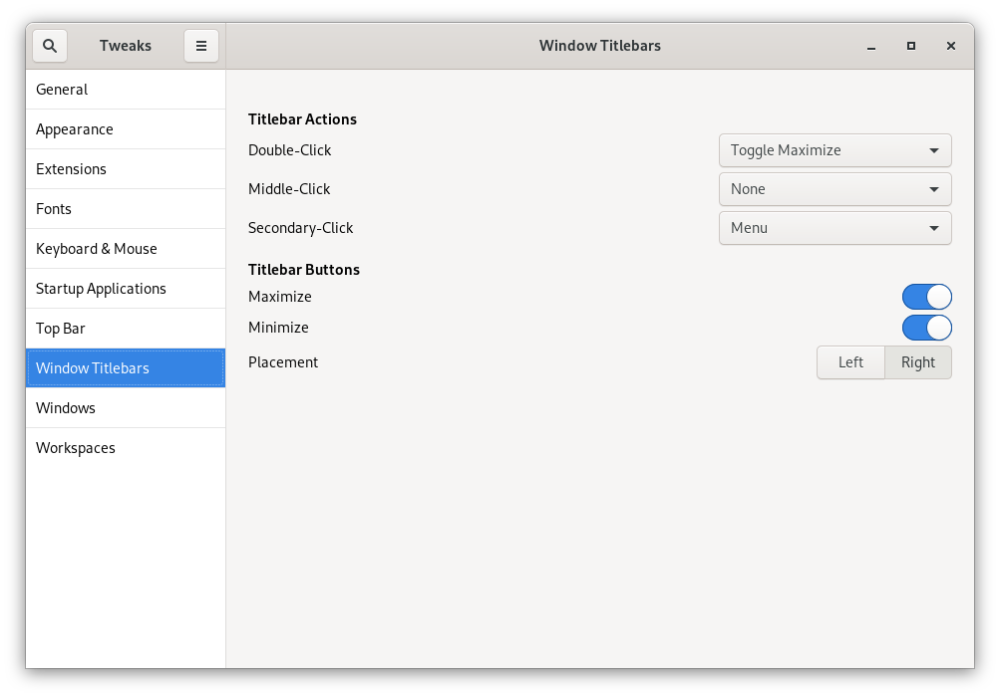

### Print Screen

```
Prt Scrn to take a screenshot of the desktop.

Alt+Prt Scrn to take a screenshot of a window.

Shift+Prt Scrn to take a screenshot of an area you selec
```

### Enable Minimize/Maximize in Windows




