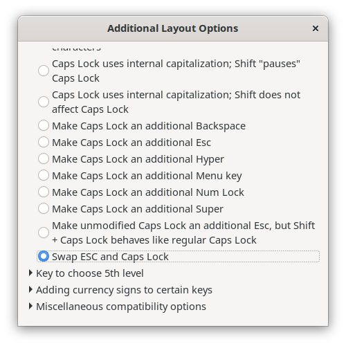

### Take Screenshot

### Shortcuts

* PrtSc – Save a screenshot of the entire screen to the “Pictures” directory.
* Shift + PrtSc – Save a screenshot of a specific region to Pictures.
* Alt + PrtSc  – Save a screenshot of the current window to Pictures.
* Ctrl + PrtSc – Copy the screenshot of the entire screen to the clipboard.
* Shift + Ctrl + PrtSc – Copy the screenshot of a specific region to the clipboard.
* Ctrl + Alt + PrtSc – Copy the screenshot of the current window to the clipboard.

### Command line

Take a screenshot of a window:

```
gnome-screenshot -w  -d 5
```

### Enable Minimize/Maximize in Windows


### Swap Caps Lock and ESC

Useful for vim.
In Tweaks tool:

1. Select "Keyboard & Mouse" from the left-hand menu.
2. Click "Additional Layout Options".
3. Click "Caps Lock behavior"
4. "Swap ESC and Caps Lock."


