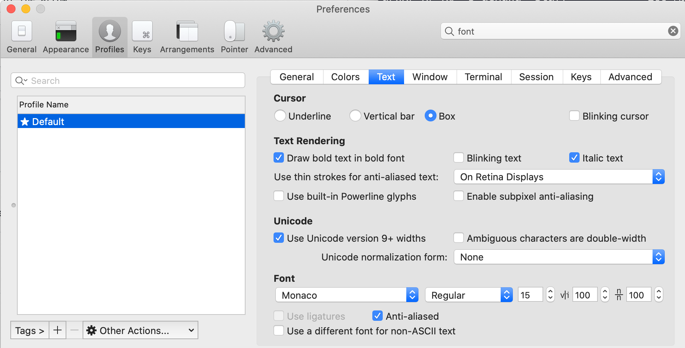

## Install iTerm2

`brew install iterm2`

## Install dark theme for iTerm2

```
git clone https://github.com/dracula/iterm.git
```

### Activating theme

1.  _iTerm2 > Preferences > Profiles > Colors Tab_
2.  Open the _Color Presets..._ drop-down in the bottom right corner
3.  Select _Import..._ from the list
4.  Select the `Dracula.itermcolors` file
5.  Select the _Dracula_ from _Color Presets..._

### Warn before closing session.

Profile --> Default --> Session --> check 'always prompt before closing'.

this is to ensure command + W not accidentally closes tab. which is the same as closing tab in chrome!

### Change Font size

Profile > Default > Text > Font



## Shortcuts

`Cmd + ]` and `Cmd + [` navigates among split panes in order of use.

⌘+⌥+←/↑/→/↓ will let you navigate split panes in the direction of the arrow.

`Cmd + <-` and `Cmd + ->` navigates among differnt tabs.
