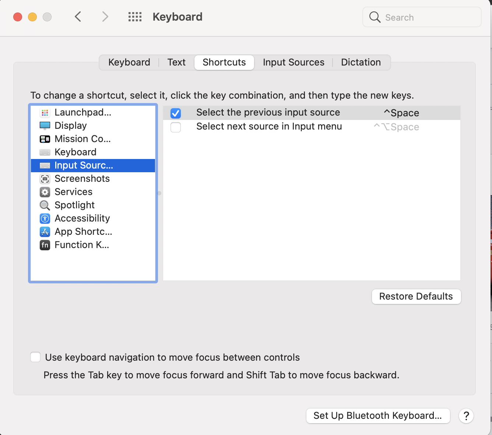
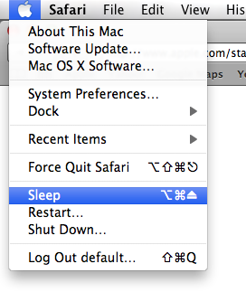
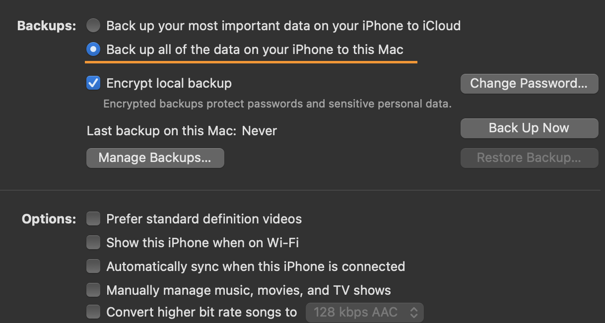
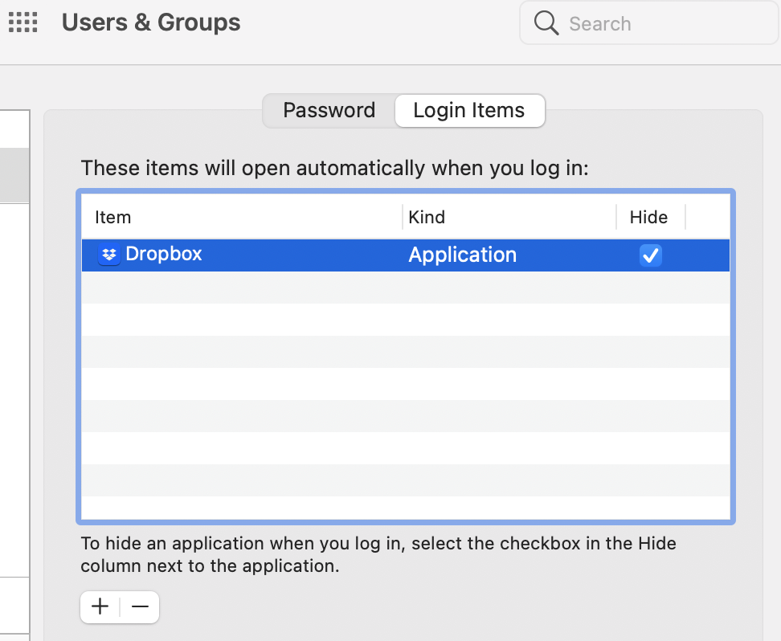
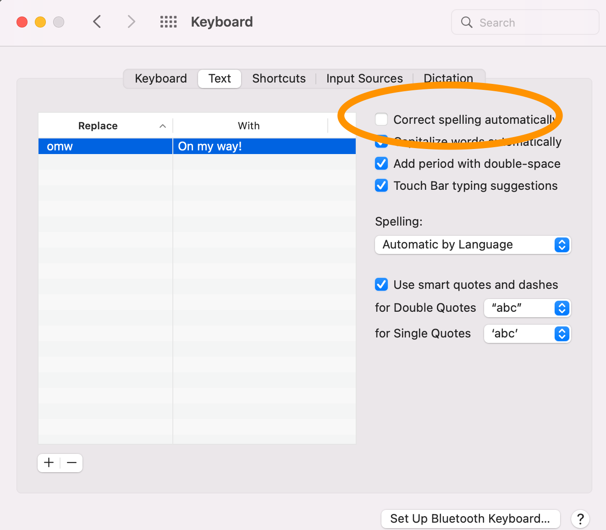
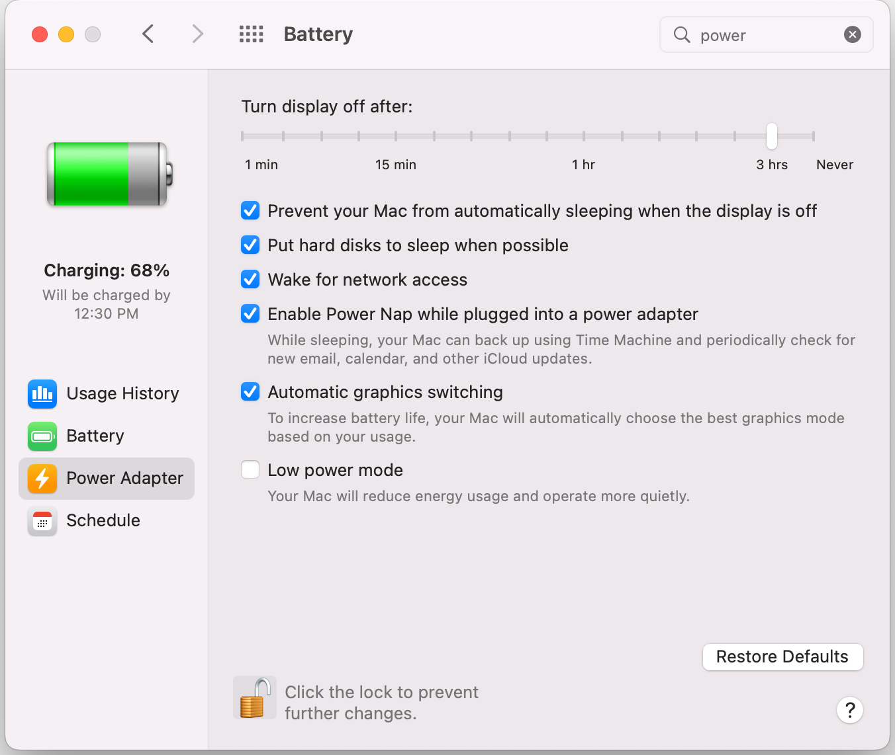
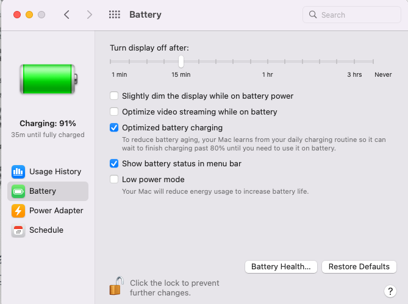
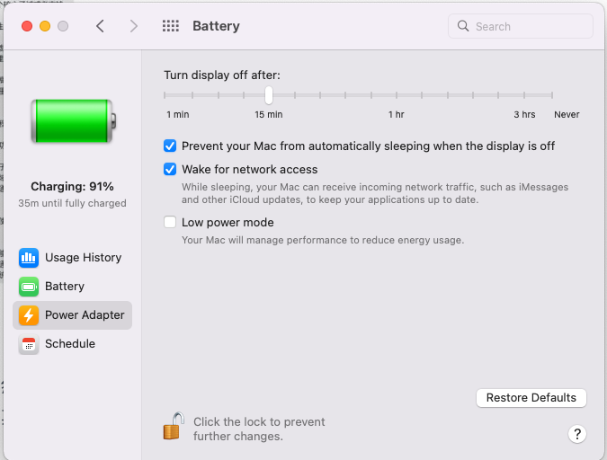

## MacOS First Time Setup

### Configure Keyboard/Mouse/Trackpad

(NOTE: may have to redo again separately for external keyboards/mouses, etc.)

* `System Preferences` --> `Mouse` --> uncheck `Scoll direction: Natural`
* `System Preferences` --> `Trackpad` --> check `Tap to Click

* System Preferences > Keyboard > Key Repeat: increase to 'Fast'
* `System Preferences` --> `Keyboard` --> 'Modify Keys' --> Change 'Caps Lock' to 'Control'
* `System Preferences` --> `Keyboard` --> Touch Bar shows 'Extended Control Strip'

### Display for Large Monitor

System Preferences > Display > Resolution: Scaled

System Preferences > Bluetooth > Check 'Show bluetooth in menu bar'

### Change Password

System Preferences > Users & Groups > 

### Homebrew

#### Install Homebrew

cmd + Tab search for 'terminal'

```
xcode-select --install
# ruby -e "$(curl -fsSL https://raw.githubusercontent.com/Homebrew/install/master/install)"
/bin/bash -c "$(curl -fsSL https://raw.githubusercontent.com/Homebrew/install/HEAD/install.sh)"
```

#### Install Cask

```
brew tap homebrew/cask
```

#### Brew Install Packages

```
  sudo chown -R $(whoami) /usr/local/bin /usr/local/lib /usr/local/sbin
```

```
# GUI Applications
# brew install --cask xxx
brew cask install iterm2
# brew cask install keepassx
brew install --cask keepassxc
brew cask install firefox
brew cask install docker
brew cask install pycharm-ce
(optional)
brew cask install chef/chef/chefdk

# CLI Applications
brew install mysql  # mysql client and server
brew install tree
brew install tty-clock
brew install ddgr
brew install watch
brew install trash-cli
brew install ansible
brew install jq
brew install wget
brew install nmap
brew install git
brew install mosh
brew install dict
brew install telnet
brew install vlc
(“VLC” can’t be opened because Apple cannot check it for malicious software.
Go to Security and click on 'Open Anyway')

# install latest java (10)
brew cask install java
# To get a list of all older versions of java:  
brew tap caskroom/versions 
brew cask search java
brew cask install java8

# the ip tool included with iproute2 on Linux.
brew install iproute2mac
```

#### Brew uninstall packages

`brew cask uninstall pycharm`

#### Brew update packages

```
brew update && brew upgrade
```

#### brew update permission denied

```
$ brew update
git@github.com: Permission denied (publickey).
fatal: Could not read from remote repository.

Please make sure you have the correct access rights
and the repository exists.
Error: Fetching /usr/local/Homebrew/Library/Taps/homebrew/homebrew-core failed!
Fetching /usr/local/Homebrew failed!
```

===>

Missing ssh key for github.

```
$ ssh-add ~/.ssh/id_rsa
Enter passphrase for /Users/gengwg/.ssh/id_rsa:
Identity added: /Users/gengwg/.ssh/id_rsa
```

#### Permission Error on Zsh

```
Error: Failed to link all completions, docs and manpages:
  Permission denied @ rb_file_s_symlink - (../../../Homebrew/completions/zsh/_brew, /usr/local/share/zsh/site-functions/_brew)
Failed during: /usr/local/bin/brew update --force --quiet
```

fix:

```
sudo chown -R $(whoami): /usr/local/share/zsh
```

#### Install Docker

```
$ brew install --cask docker
....
==> Moving App 'Docker.app' to '/Applications/Docker.app'
🍺  docker was successfully installed!
```

After that `docker` command is still not available:

```
$ docker info
bash: docker: command not found
$ type docker
bash: type: docker: not found
```

This is because docker needs permission to install binaries. CMD + space. Seach docker. It will pop up a window asking sudo password. After that you should be able use docker on command line.

```
$ type docker
docker is /usr/local/bin/docker
```

#### Ignore formula on brew upgrade

```
$ brew pin git
```

### Configure iTerm2

Follow [here](https://github.com/gengwg/cheatsheets/blob/master/iterm2.md).

### Configure Vim

Follow [here](https://github.com/gengwg/cheatsheets/blob/master/vim.md).

### Configure VS Code

Follow [here](https://github.com/gengwg/cheatsheets/blob/master/vscode.md).

### Set up Configs for Shell/Vim/SSH

* Copy .bash_profile, .bashrc, .bash_aliases file to home dir.
* Copy vimrc to .vimrc
* Copy ssh_config

*or use hard/soft link if already have them in dropbox so updates will be synced.*

### Change default web browser to Chrome

* Choose System Preferences from the Apple () menu.
* Click General.
* Choose your web browser from the ”Default web browser” pop-up menu.

### Install Amphetamine (Optional)

App Store > Search 'Amphetamine'

*This is optional. You can use finger prints.*

### Add Chinese Input Method

1. `System Preferences` --> Keyboard --> Input Sources --> + --> Choose `Chinese` on the left --> Select `Pinyin - Simplified`, press `Add`
2. Set up shortcut (Control + Space) for switching input method: 
	* `System Preferences` --> `Keyboard` --> `Shortcuts` --> Check `Select previous input source`




### Use bash as default login shell

Add in `.zshrc`:

```
exec -l bash
```

### Restore previous SSH Keys (optional)

Copy the old Mac ssh keys to `~/.ssh` folder (and ssh-add them to ssh-agent if necessary), so that don't have to redo `ssh-cop-id` for new keys to remote servers.


### Restore previous SSH Keys (optional)

copy the old Mac ssh keys to `~/.ssh` so that don't have to redo `ssh-cop-id` for auto login remote servers.

## Keyboard shortcuts

|             Press             |                      Do This                      |
|:-----------------------------:|:--------------------------------------------------|
|         cmd + ctrl + q        | lock screen                                       |
| Command + Shift + 4           | Save a Screenshot to local file                   |
| Command + Shift + 4 + Space   | Save a Screenshot of current window to local file |
| Command + Control + Shift + 4 | Save a Screenshot to the Clipboard                |
| Command + Shift + 5           | Screen recording                                  |
| Ctrl + left/right arrow       | Switch between desktops                           |

### Putting your computer to sleep



### Open Finder

1. `Cmd + Tab` and navigate to Finder.
2. `Cmd + Up`. This will take you into your Home directory.

### Copying and pasting to the pasteboard (the Clipboard) from command line

```
$ pbcopy < test.txt
$ pbpaste
This is a test.
```

### Check with process uses port 9090

```
lsof -i tcp:9090
```

### Command line search using Spotlight

```
mdfind <key words>
```

## Notes

### Fixing mac os yosemite issue "bash: fork: Resource temporarily unavailable"

see the current limits:
```
$ sysctl -a | grep maxproc
kern.maxproc: 1064
kern.maxprocperuid: 709
```

```
$ sudo sysctl -w kern.maxproc=4096
kern.maxproc: 1064
sysctl: kern.maxproc=4096: Invalid argument
```

===> maxproc is limited to 2500 with OS X unless you install OS X Server.

```
$ sudo sysctl -w kern.maxproc=2500
kern.maxproc: 1064 -> 2500
$ sudo sysctl -w kern.maxprocperuid=2400
kern.maxprocperuid: 1024 -> 2400

```

see the current limits:
```
$ sudo launchctl limit
	cpu         unlimited      unlimited
	filesize    unlimited      unlimited
	data        unlimited      unlimited
	stack       8388608        67104768
	core        0              unlimited
	rss         unlimited      unlimited
	memlock     unlimited      unlimited
	maxproc     709            1064
	maxfiles    256            unlimited
```

change to number above:
```
$ sudo launchctl limit maxproc 2400 2500
$ sudo launchctl limit maxfiles 512 unlimited
```

see the current limits:
```
$ sudo launchctl limit
	cpu         unlimited      unlimited
	filesize    unlimited      unlimited
	data        unlimited      unlimited
	stack       8388608        67104768
	core        0              unlimited
	rss         unlimited      unlimited
	memlock     unlimited      unlimited
	maxproc     2400           2500
	maxfiles    512            10240
```

Note this does not endure a reboot. To keep config after reboot:  
https://superuser.com/questions/836883/increasing-yosemite-maxfile-limit-for-application

### To override security settings and open the app from unidentified developer

1. In the Finder, locate the app you want to open. 
2. Press the Control key, then click the app icon.
3. Choose Open from the shortcut menu.
4. Click Open.

Or Go to Security and click on 'Open Anyway'.
Next time you open the app, it will show the 'Open' option.

###  Bypass running only apps from App store

> Your security preferences allow installation of only apps from the App Store and identified developers

If above methold not work,

Typically for a MacOS app, you have an executable under "<your.app>/Contents/MacOS". For example:
`/Applications/VNote.app/Contents/MacOS/VNote`

Finally you may want to add in `~/.bash_aliases`:  
```alias vnote='/Applications/VNote.app/Contents/MacOS/VNote'```

### access usb disk

`cd /Volumes/SANDISK`

### kill a frozen program

cmd + space -> search 'monitor'
then choose Activity Monitor.
find that process and kill it, or force quit.

or press:
cmd + option + esc

### get mouse out of vbox VM

press left cmd button

### view pdf from terminal
$ open myfile.pdf


### connect to SMB (samba/CIFS) share
https://users.wfu.edu/yipcw/atg/apple/smb/

Go | Connect to Server

smb://servername/sharename
e.g.:
smb://192.168.1.70/gengwg

```
$ brew install htop
xcrun: error: invalid active developer path (/Library/Developer/CommandLineTools), missing xcrun at: /Library/Developer/CommandLineTools/usr/bin/xcrun
Error: Failure while executing: git config --local --replace-all homebrew.private true
===>
$ xcode-select --install
It will call the XCode installer for the command line developer tools. A window will open requesting for you to install them. All you have to do is click the install button
```

### Modify host file 
sudo vim /private/etc/hosts


### brew local install sshpass w/o access to sourceforge

On some server that has access sourceforge:
```
%) wget http://sourceforge.net/projects/sshpass/files/sshpass/1.06/sshpass-1.06.tar.gz
%) python -m SimpleHTTPServer 8000
```

On Mac:

    wget  https://raw.githubusercontent.com/kadwanev/bigboybrew/master/Library/Formula/sshpass.rb

Modify the url to the above server IP, where you set up a HTTP server.
```
  # url 'http://sourceforge.net/projects/sshpass/files/sshpass/1.06/sshpass-1.06.tar.gz'
  url 'http://10.93.81.178:8000/sshpass-1.06.tar.gz'
```

Brew local install.
```
$ brew install ./sshpass.rb
==> Downloading http://10.93.81.178:8000/sshpass-1.06.tar.gz
...
```

### Play slideshow w/o music in Photos

Select "Play Slideshow"  
Select "Music"  
Uncheck the song that's playing (usually Classic)  

### Retain Data When Replacing iPhone

1. Backup Old iPhone to Mac

Connect old iphone to Mac via USB. Open the Finder. Find your device, e.g. xxx's iPhone.

Make sure to choose 2nd option 'back up data to Mac'. Default is 1st option to iCloud. Click on 'Back Up Now'.



2. Restore Backup to New iPhone

Disconnect old iPhone and connect new iPhone to Mac via USB. It will automatically ask if you want to restore from backup. Click continue. You will be prompted for the password used to encrypt the backup. It's your phone's password. Then it starts restroing from backup and reboot. Restore process takes about 30 minutes.

### Intall VirtualBox

Install virtualbox and the extension pack:

```
$ brew install --cask virtualbox
$ brew install --cask virtualbox-extension-pack
```

Go to: System Preferences → Security & Privacy → General . Click on 'lock to make changes' and allow Oracle. It will ask to restart computer.

### Disable Auto Start Programs

'Users & Groups' --> click on 'current user' --> click on 'Login items' --> check the box next to the items you want to disable, then click the '-' at the bottom.



### Disable Spelling Auto-correct (annoying)

Go to: System Prefs -> Keyboard -> Text in macOS. Uncheck 'Correct spelling automatically'.




### Disable low power mode (annoying)

Each time I connect to power it dims the screen. Just uncheck 'Low power mode'.



### Disable dim display on battery

Consistent brightness on battery and power adapter.



### Disable auto sleep when disaply is off

This prevents SSH sessions from dropping, for example.



### -bash: _filedir: command not found

Seeing the error when doing kubectl auto complete.

Add below to bashrc:

```
source $(brew --prefix)/etc/bash_completion
```

### Dealing with spaces in ssh option

Methold 1: quote it.

```
$ ssh  -o 'ControlPath="/Users/gengwg/Library/Application Support/mytunnel.sock"' my.server
```

Method 2: use symlink.

```
$ ln -s '/Users/gengwg/Library/Application Support/tunnel.sock' /tmp/my.sock
$ ssh -o ControlPath=/tmp/my.sock my.server
```

Method 3: use ssh config

```
Host myserver
    hostname my.server.example.com
    user gengwg
    ControlPersist yes
    ControlPath="/Users/gengwg/Library/Application Support/mytunnel.sock"
```

The advantage of using ssh config is you can ssh to your devvm w/o typing anything:

```
$ sftp myserver
Connected to server.
sftp>
```
