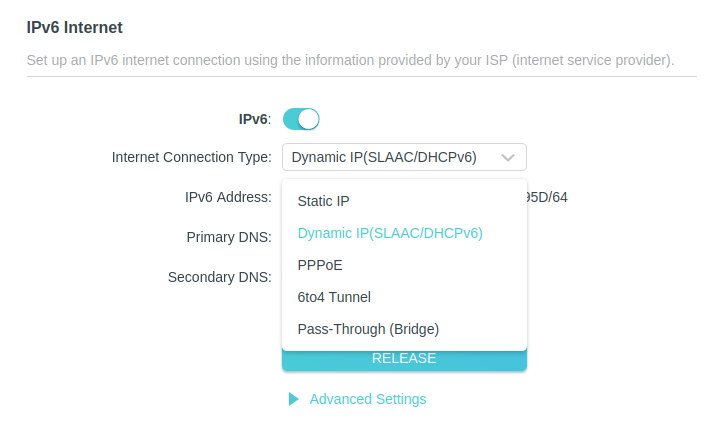

## CentOS 7 disable IPv6 SLAAC EUI-64 Address Generation

https://serverfault.com/questions/1045209/centos-disable-ipv6-slaac-eui-64-address-generation


Put `IPV6_AUTOCONF=no` both: 

- under the interface config. e.g. `/etc/sysconfig/network-scripts/ifcfg-eth0`;
- also in `/etc/sysconfig/network`.

Then the SLAAC was disabled completely and with that also the EUI-64 address

## NC Check If Port Open on Server

```
# linux
$ nc -vz theexample.com 443
Ncat: Version 7.70 ( https://nmap.org/ncat )
Ncat: Connected to 2a03:2880:fd44:xxxx:xxxx:xxxx:0::443.
Ncat: 0 bytes sent, 0 bytes received in 0.04 seconds.
$ nc -vz google.com 443
Ncat: Version 7.70 ( https://nmap.org/ncat )
Ncat: Connection to 2607:f8b0:4004:837::200e failed: Connection timed out.
Ncat: Trying next address...
Ncat: Network is unreachable.

# mac
$ nc -vz google.com 443
Connection to google.com port 443 [tcp/https] succeeded!
$ nc -vz google.com 6443 # twice is due to ipv6 and ipv4.
nc: connectx to google.com port 6443 (tcp) failed: Operation timed out
nc: connectx to google.com port 6443 (tcp) failed: Operation timed out
```

## invoke telnet from  different interfaces

```
# linux
telnet -b <sourceaddress> <destination> <port>

# mac
telnet -s <sourceaddress> <destination> <port>
```

## Check which device and IP to use to reach an IPv6 address

```
$ dig AAAA google.com +short
2607:f8b0:4005:80e::200e
$ ip route get to 2607:f8b0:4005:813::200e
2607:f8b0:4005:813::200e via 2620:10d:xxxx:xxx dev eth0 src 2620:10d:xxxx:xxxx metric 1 pref medium
```

## Check IPv6 default route

```
ip -6 route list default
default via 2620:10d:xxxxxxxx dev eth0 metric 1 pref medium
default via fe80::200:xxxxxxx dev eth0 proto ra metric 1024 expires 466sec hoplimit 64 pref high
```

## Ipv6 show only dynamic or permanent addresses of an interface

```
$ ip -6 a sh eth0 dynamic
2: eth0: <BROADCAST,MULTICAST,UP,LOWER_UP> mtu 1500 state UP qlen 1000
    inet6 xxxxxxxx/64 scope global mngtmpaddr dynamic
       valid_lft 92sec preferred_lft 92sec
$ ip -6  a sh eth0 permanent
2: eth0: <BROADCAST,MULTICAST,UP,LOWER_UP> mtu 1500 state UP qlen 1000
    inet6 2620:xxxxxx/64 scope global
       valid_lft forever preferred_lft forever
    inet6 fe80::xxxx/64 scope link
       valid_lft forever preferred_lft forever
```

## Ping multiple hosts at the same time

```
fping6 < myhosts.txt
```

## Ping IPv6 link-local address

```
$ ping -6 fe80::xxxxx
ping: sendmsg: Invalid argument
ping: sendmsg: Invalid argument
2 packets transmitted, 0 received, 100% packet loss, time 1038ms
```

===>

IPv6 link-local always requires an interface since there's one for every interface:

```
$ ping fe80::xxxxx%eth0
```

Or (need sudo):

```
$ ping6 -I eth0 fe80::xxxxx
setsockopt(SO_BINDTODEVICE): Operation not permitted
$ sudo !!
sudo ping6 -I eth0 fe80::xxxxx
ping6: Warning: source address might be selected on device other than eth0.
```

## Check Ipv6 address

```
$ ip a sh eno1
2: eno1: <BROADCAST,MULTICAST,UP,LOWER_UP> mtu 1500 qdisc fq_codel state UP group default qlen 1000
    link/ether 44:39:xxxxxxxxxx brd ff:ff:ff:ff:ff:ff
    altname enp0s25
    inet 192.168.10.1xx/24 brd 192.168.10.255 scope global dynamic noprefixroute eno1
       valid_lft 167523sec preferred_lft 167523sec
    inet6 2601:641:xxxxxxxxxxxxxxxxxx/64 scope global dynamic noprefixroute
       valid_lft 293sec preferred_lft 293sec
    inet6 fe80::xxxxxxxxxxxxxxxxxx/64 scope link noprefixroute
       valid_lft forever preferred_lft forever
```

Go to   https://test-ipv6.com/

```
	Your IPv4 address on the public Internet appears to be x.x.x.x

	Your IPv6 address on the public Internet appears to be 2601:641:xxxxxxxxxxxxxxxxx # Same as above

	Your Internet Service Provider (ISP) appears to be XXXX

	Your DNS server (possibly run by your ISP) appears to have IPv6 Internet access.
```

# TP Link

## Enable IPv6

Go to: Advanced > `Ipv6` tab on the left. Dropdown choose 'Dynamic IP'.




