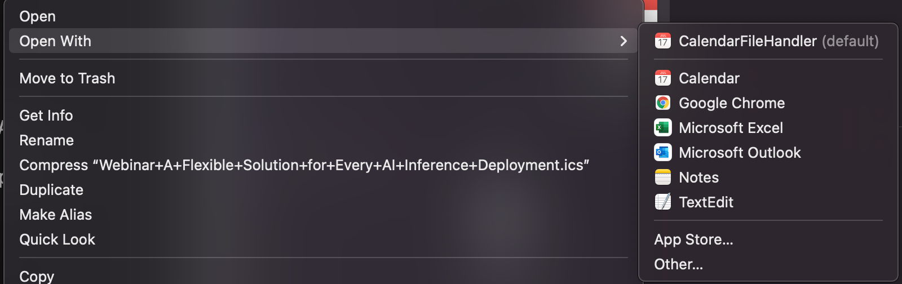

# Outlook

## Shortcuts

### Mail

| To do this                                   | Press           |
|----------------------------------------------|-----------------|
| Reply to a message                           | CMD + R         |
| Reply to All                                 | CMD + SHIFT + R |
| Delete selected item                         | DELETE          |
| Move the selected item to a different folder | CMD + SHIFT + M |
| Undo an action                               | CMD + Z         |
| Search Current Mailbox                       | CMD + SHIFT + F |

Outlook Web:

| To do this                                   | Press           |
|----------------------------------------------|-----------------|
| Reply to a message                           | CMD + R         |

### Calendar 

| To do this                                   | Press           |
|----------------------------------------------|-----------------|
| Archive message                              | E               |
| Delete message                               | DELETE          |

## Tips

use room finder to find a room

### import ics file to calendar

two methods:

1. just drag it to calendar!
2. right click ics file in Finder and open with outlook

### Switch between inbox, calendar, contacts
 
Methods:
1. `Alt/Cmd + 1, 2, 3`
2. Click at the bottom left tabs

### Go to the previous/next week in Calendar
`Cmd + Left/Right Arrow `

### Outlook Calendar Add 2nd Time Zone

Click on 'Outlook' by the Apple logo, then go to: 'Preferences' > 'Calendar' > 'Time zones'.
Check 'second time zone'. Optionally give it a nickname.

### Disable notification sounds

Outlook > Preferences > For new messages: uncheck 'display alert on my desktop'

Sounds > Uncheck all

### View raw email source

Right click on the title for the email > 'View Source'

Usage: Can be used to find links that are not clickable in the email.
